Tutorial
========

This tutorial will take you through the usual stages of using SublimeGit for managing a project. We will go through building the `Django tutorial <https://docs.djangoproject.com/en/1.5/intro/tutorial01/>`_ application, and managing it in git. We'll be skipping lightly over the coding parts and focusing on using SublimeGit, so it should be usable for any project using git.

Getting Set Up
--------------
The first thing we've done is made a virtual environment, set up a requirements.txt, installed django and initialized a django project. That means our project folder now looks something like this:

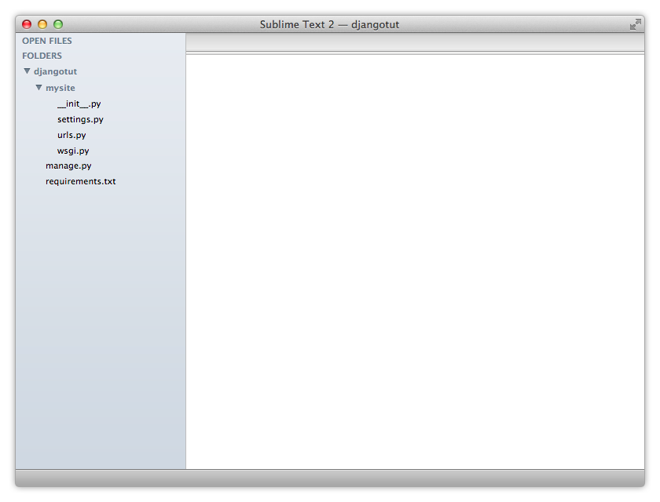

Initialize a Repository
-----------------------
Now, there isn't much work worth saving in this project yet, but we're gonna start adding some, so now might be a good time to put the project in git.

To do this, first make sure that you have the project open in Sublime Text. It doesn't need to be opened as a Sublime Text project, and personally I prefer to just open folders directly from the command line, or through the **File > Open...** menu.

.. note::
    Notice how we've opened the entire folder in Sublime Text. This isn't required, but it will make initializing the git repository much smoother, since SublimeGit will have an easier time figuring out where to put it.

    See the :ref:`Git: Init <cmd-git-init>` command for more information on how SublimeGit chooses a path for the repo.

To initialize the git repository, open the command palette, and find the **Git: Init** command. But wait a minute. You don't want to be typing out full command names for everything. Luckily, Sublime Text is pretty intelligent about matching commands, so to find the **Git: Init** command, we should just be able to start typing. Generally, all of the commands in SublimeGit start with the **Git:** prefix, so let's try just typing ``ginit``.

.. image:: img/tutorial/tutorial02.png

Once we're at ``gin``, Sublime Text should have selected the right command. Now press enter, and you will be presented with a choice of where to put the repository on the bottom of the screen:

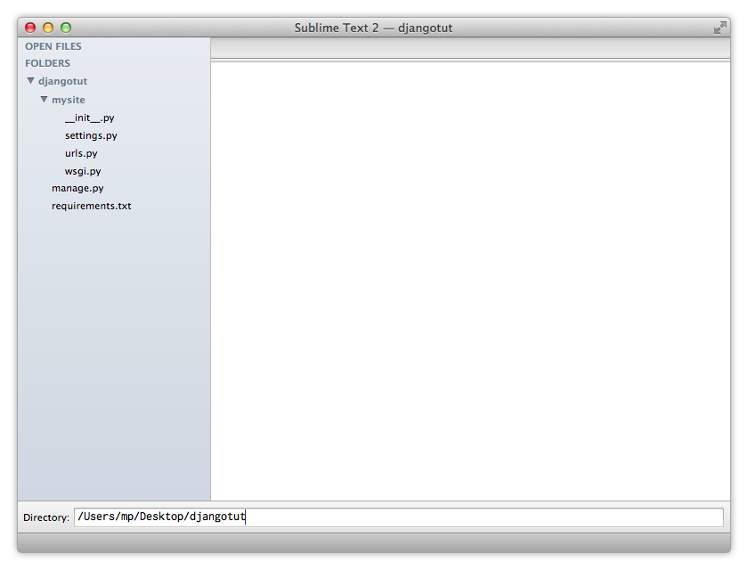

If you've opened our project as a folder, then the default value should be sufficient, and you can press enter to select it. After creating the git repository, SublimeGit will show you the output of the git command in a console window:

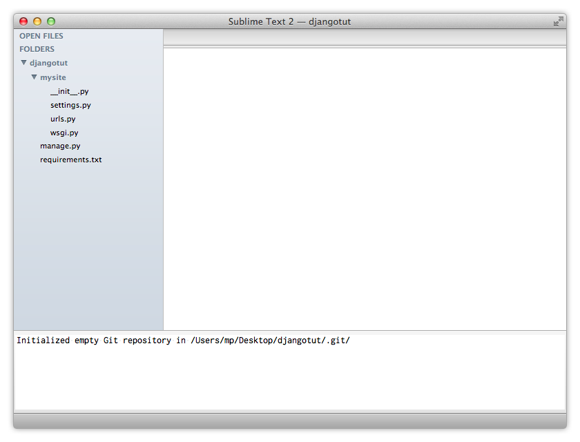

To dismiss this console window, press ``escape``.

.. note::
    Another way to initialize a repository is to just start using the **Git: Status** command. If you aren't on a repository, SublimeGit will ask you to initialize one.

Adding Content
--------------
So now that we have an empty repository, we can start adding our files.

.. warning::
    Using SublimeGit to perform the initial commit on a huge project (1000+ files) might not be the best way to go. Getting the list of untracked files from git, and formatting them nicely can take some time.

    If you are dealing with a huge project, you might want to use the command line for the initial commit.

The Status View
~~~~~~~~~~~~~~~
Most of the adding/staging/unstaging and so on happens from the :ref:`Git: Status<cmd-git-status>` command, so let's run that. Typing ``gs`` in the command palette should be sufficient to bring it up:

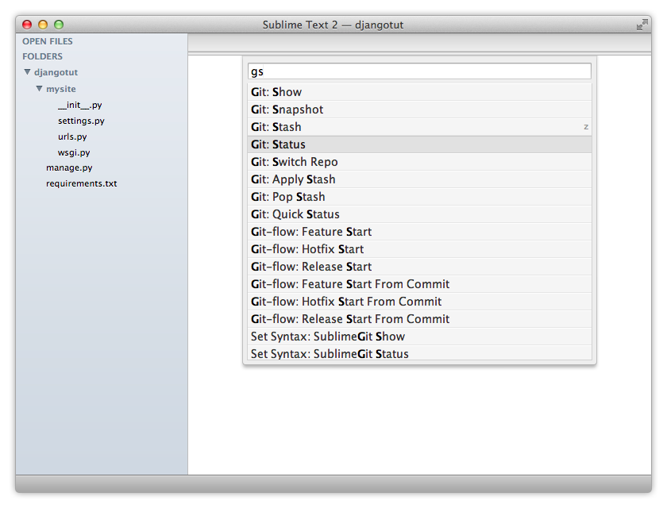

After executing the command, we should see a status view looking something like this:

.. image:: img/tutorial/tutorial06.png

This view contains the following information for our new project:

**Local**
    Information on our current branch (master), and the location of our repository (~/Desktop/djangotut)
**Head**
    Info about the current HEAD commit. Since we haven't committed anything yet, there is nothing to show. After our first commit, we will be able to see the abbreviated SHA1, and the first line of the commit message.
**Untracked files**
    This section shows files inside our project which have yet to be added to git. When we get a little further, some more sections will show up, such as unstaged changes, staged changes and stashes.
**Help**
    The bottom of the view shows the available keyboard shortcuts.

Ignoring Files
~~~~~~~~~~~~~~
Now, looking at our status view, we notice that we've got those pesky .pyc files. We definitely don't want to add those to git, so let's ignore them.

Pressing ``i`` on a file will add that file to the ``.gitignore`` for the repository. But we don't want to add just a single .pyc file, we want to add the pattern \*.pyc so we don't have to deal with them again. Pressing ``I`` (capital I) will give you a choice of the pattern to add to the gitignore:

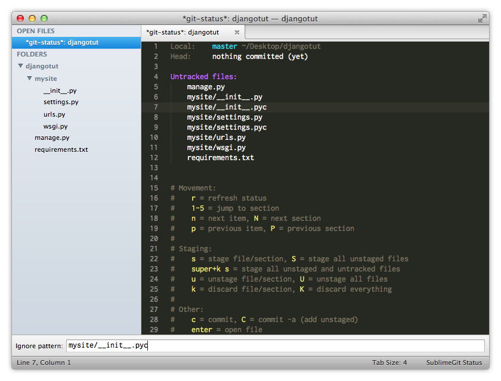

Now, let's change the pattern to \*.pyc:

.. image:: img/tutorial/tutorial08.png

Pressing ``enter`` will ask you to confirm your choice, and after doing so, we can see that the .pyc files have been removed from the status view, and a gitignore file have been added:

.. image:: img/tutorial/tutorial10.png

Adding Files
~~~~~~~~~~~~
Now, to add the files, there are several different ways to go.

We can press ``s`` on each file individually, and allow the status window to update between each press. If we don't want to wait for the status window to update, we can also select all of the files we'd like to add, and then press ``s``. Or we could use Sublime Text's awesome multiple caret feature and place a caret on every line before pressing ``s``. This will add all of the files, since SublimeGit supports multiple selection.

Another way to go would be placing the caret on the section header and pressing ``s``.

Finally, we could press ``ctrl+shift+s`` which will add everything. This command can result in a lot of changes, which is why it's purposefully been made a little hard to type.

Let's go with placing the cursor on the section and pressing ``s``:

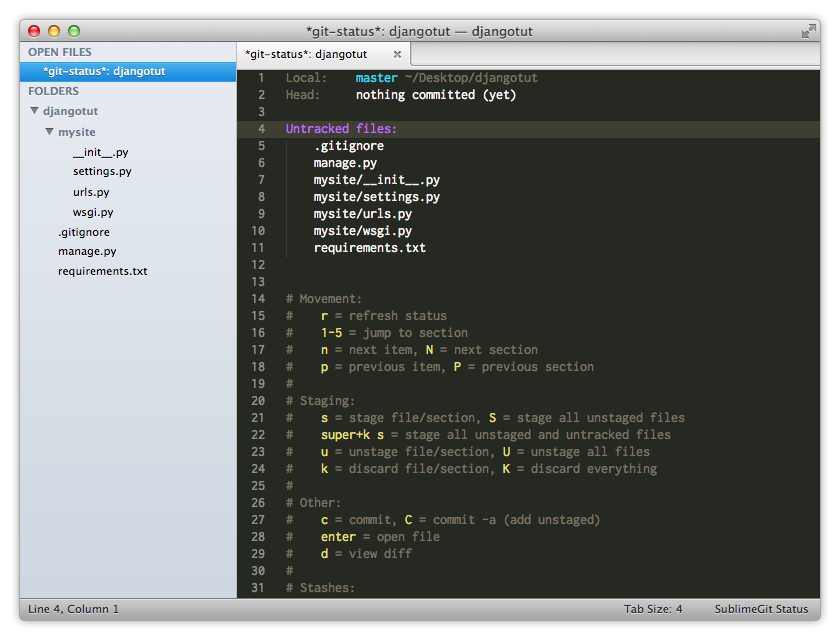

Pressing ``s`` moves the files to the **Staged changes** section:

.. image:: img/tutorial/tutorial14.png

Now we are ready to make the initial commit on our project.

Other Ways to Add Files
~~~~~~~~~~~~~~~~~~~~~~~
Using the status view isn't the only way to add files in SublimeGit. See :ref:`cmd-adding-files` in the :doc:`commands` for alternatives.

Committing
----------
To enter the commit view, press ``c`` in the status view. This will bring op a view for you to enter a commit message, and place the caret so that you can start typing right away:

.. note::
    This view contains a vertical ruler set at 72 characters. This is to encourage good commit message style, as detailed by `Tim Pope <http://tbaggery.com/2008/04/19/a-note-about-git-commit-messages.html>`_ and `Linus Thorvalds <https://github.com/torvalds/subsurface/blob/master/README#L272>`_ among others.

    If you write your commit messages like this, other developers will nod their head in quiet approval, a thousand adorable kittens will be saved, and riches will rain from the sky. Also, you'll get a nice git log, and pretty commit messages on github.

So let's type our commit message:

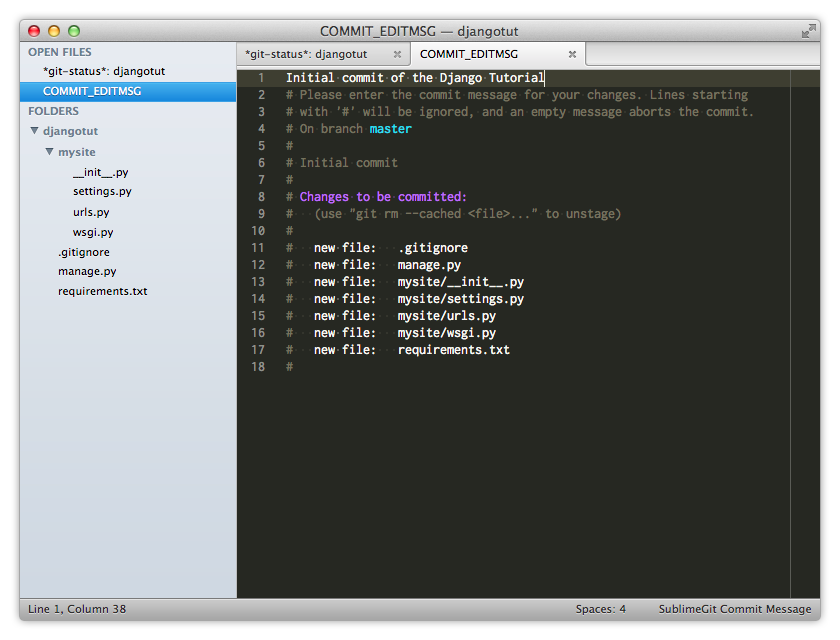

Once we're done with typing, closing the view will perform the commit and notify us in a console panel:

.. image:: img/tutorial/tutorial15.png

We can now see that our **Head** information has been updated, and that the working directory is clean.

Aborting a Commit
~~~~~~~~~~~~~~~~~
What if we change our mind halfway through writing the commit message? At that point closing the file would commit a half-finished commit. The solution is simple. Just delete the commit message. This can be done by selecting everything (``cmd+a`` on OS X, ``ctrl+a`` on Linux/Windows) followed by ``delete``.

Closing an empty commit view will abort the commit, and let you know:

.. image:: img/tutorial/tutorial14.png

Staging Changes
---------------
So now that we've made our initial commit, let's make some more changes to the project.

After changing the settings around and adding a polls app, the status view now looks like this:

.. image:: img/tutorial/tutorial16.png

Since we are actually doing two separate things here we might want to split it up into two commits, one containing the changes to settings.py and the other containing our initial polls app.

But first, let's take a look at what we've actually changed.

Viewing Diffs
~~~~~~~~~~~~~
Navigate to the **Changes** section. A quick way to do this is by pressing ``2`` to jump to the second section, followed by ``n`` for next item. Another way would be by pressing ``Nn`` for next section followed by next file.

.. image:: img/tutorial/tutorial17.png

Once the caret is over the file, press ``d`` to open a diff view:

.. image:: img/tutorial/tutorial18.png

As we can see here, we've changed the database settings, the timezone, as well as enabled the admin application.

While viewing this diff, we realize that we probably need to add a template directory as well. So let's close the diff view, and open the file to add the template directory.

Opening a File
~~~~~~~~~~~~~~
Back in the status view, the caret should still be on the settings file. Pressing ``enter`` will open the file for editing:

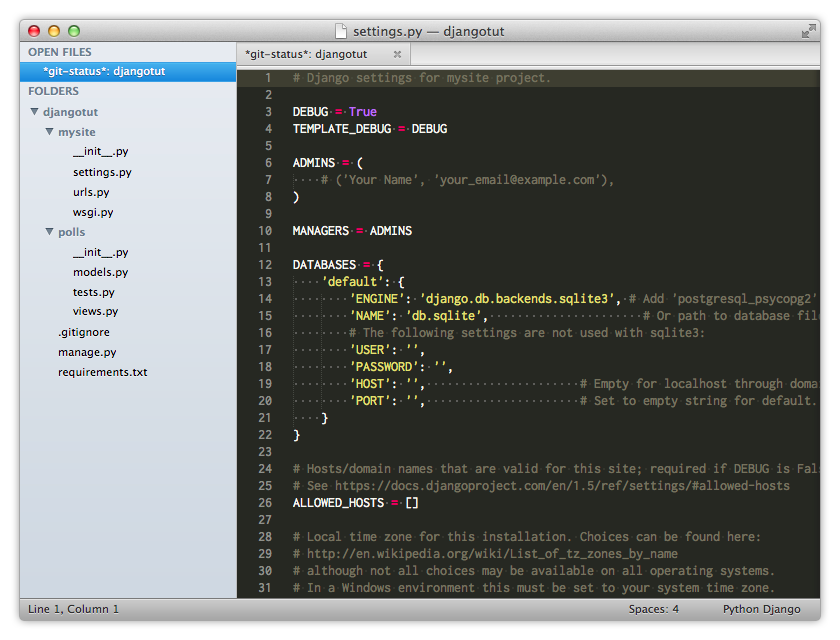

After adding the missing setting, we can view a diff again to see that the change has been picked up:

.. image:: img/tutorial/tutorial20.png

Now we're ready to commit. To do so, press ``s`` on the file, followed by ``c`` to open the commit view.

Unstaging Files
~~~~~~~~~~~~~~~
For the second commit, let's start by adding the polls application exactly as before:

.. image:: img/tutorial/tutorial21.png

But what if we want to do a little bit of work on it before adding it the first time? Now we've already staged it, so we need a way to undo that.

For that purpose, we can use ``u`` to unstage single files or entire sections, or ``U`` to unstage everything. This works exactly like the ``s``/``S`` commands described earlier.

Let's use the ``U`` command since that will unstage everything at once. Press ``U`` anywhere in the status view. The files will then jump back to the **Untracked Files** section:

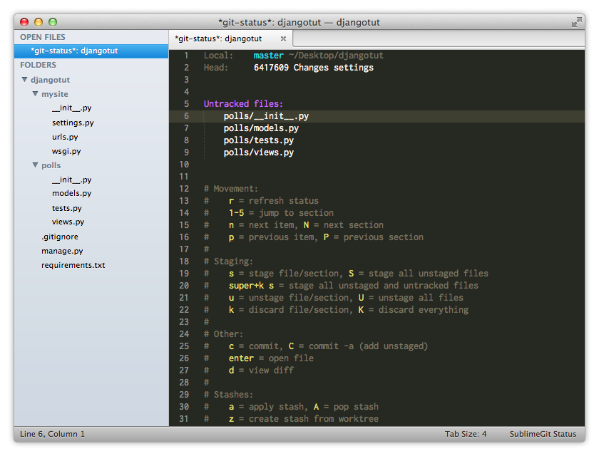

Sharing Our Project With the World
----------------------------------
Now that we're getting some traction on our project, we might want to start sharing it with the world. To do that we've created a github (or bitbucket, or google code, or breanstalk, etc.) repository for it. In our case it has the url *git@github.com:SublimeGit/djangotut.git*.

Adding a Remote
~~~~~~~~~~~~~~~
To add this remote, execute the command :ref:`Git: Add Remote <cmd-add-remote>`, again using Sublime Text's fuzzy matching to avoid typing all of it:

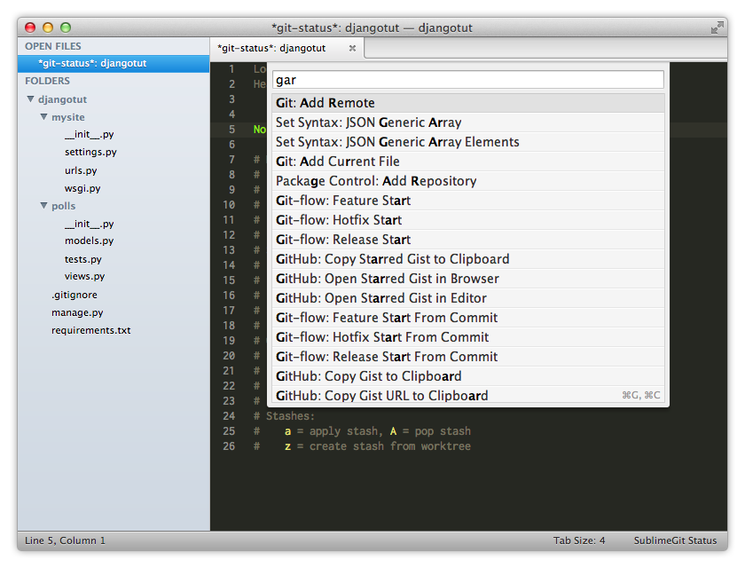

After selecting the command, we will be asked to provide a name for the remote. If this is the first remote we are adding, SublimeGit will assume we want to name it **origin** since that's the convention:

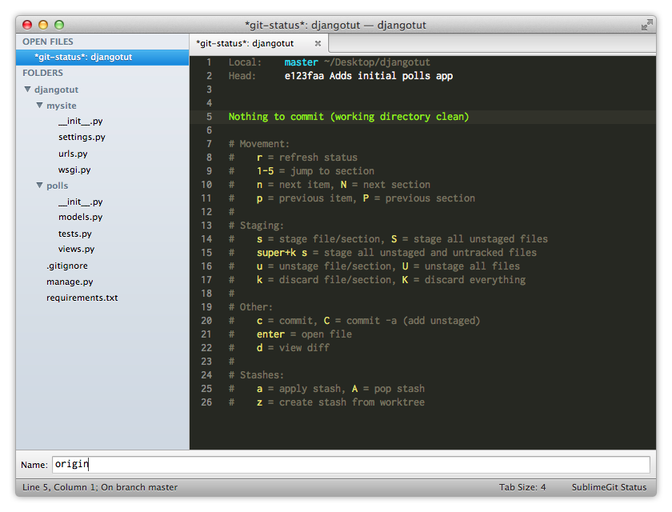

After pressing ``enter`` to confirm the name, we will be asked to add the url of the remote:

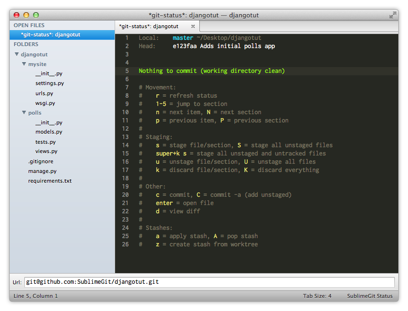

When the url is confirmed, SublimeGit will open the remote management interface. This is the same options you will get if you execute the :ref:`Git: Remote <cmd-remote>` command.

Pushing
~~~~~~~
.. note::
    If you added a remote which wasn't empty (such as when initilized with a README through github), you might need to execute the :ref:`Git: Pull <cmd-pull>` command before pushing.

Now, if we try to just execute :ref:`Git: Push <cmd-push>` we might be in for a surprise:

.. image:: img/tutorial/tutorial28.png

What gives? Well, since we've only just added the remote, without specifying it as the default remote for any of the branches, we need to push a little bit differently the first time around.

To do this, execute the command :ref:`Git: Push Current Branch <cmd-push-current-branch>`:

.. image:: img/tutorial/tutorial29.png

Then we have to enter the name of the branch on the remote. By default, the current branch name is selected:

.. image:: img/tutorial/tutorial30.png

After pressing ``enter``, SublimeGit will push the branch to the remote, as well as set the necessary configuration to allow using the :ref:`Git: Push <cmd-push>` and :ref:`Git: Pull <cmd-pull>` commands in the future:

.. image:: img/tutorial/tutorial31.png

Also notice how a remote section shows up in the status view. This shows the remote url, and the name of the remote.

Branching
---------
See the section :ref:`branching-merging` in the :doc:`commands`.

Stashing
--------
See the section :ref:`stashing` in the :doc:`commands`.

Finding Help
------------
To find help on a specific git command, you can use the :ref:`Git: Help <cmd-help>` command, which uses the built-in git html documentation.

Further Reading
~~~~~~~~~~~~~~~
While this tutorial covers the most important parts of SublimeGit, there is a lot more to explore. Take a look at the :doc:`commands` for a list of all the available commands, or have a look at the :doc:`plugins` section for information on how to use the SublimeGit plugins.
